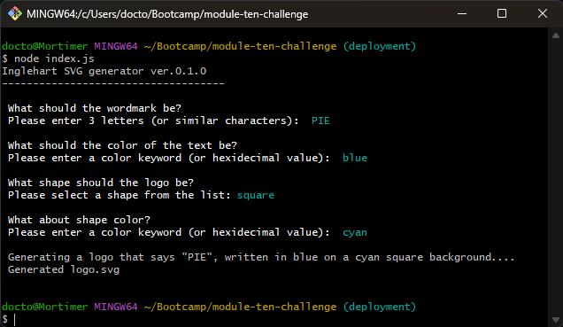

# SVG Logo Maker

The SVG Logo Maker generates logos in an SVG format! The logos always have 3 letters (or similar characters), standing out in front of a simple, geometric shape. The content is determined by user input.

## Description

SVG Logo Maker generates small (300 x 200 pixel) SVG files. It uses inquirer.js to prompt the users with a series of questions that define:

* The 3 character combination

* The text color

* The shape color

* Whether the shape is to be a circle, a triangle, or a square

The background is always transparent. The shape and the text are both centered, more or less. If the text input is too long, only the first 3 characters will be applied to the logo. If an invalid color input is chosen, Logo Maker will default to something valid (orange for shape color, and/or blue for text color)

## Video Demonstration

[Inglehart SVG Logo Generator](https://watch.screencastify.com/v/INgVtIa9LLbU84yxf6lF)

## A screenshot of the Generator being used in a Git Bash terminal on Windows:

## Usage Instructions

Open a terminal in the appropriate directory, run `npm i`, then `npm init`, then `node index.js`. Answer the questions Logo Maker asks in the CLI. Logo Maker will create a SVG according to your specifications; it will be in the same directory as index.js.

Make sure you run Logo Maker with write permissions! It needs to create a file in order for it to work.

Note that Logo Maker is only capable of making files named "logo.svg", and it will overwrite any existing "logo.svg"" in its directory. That includes other "logo.svg"s that it made earlier.

## Testing Instructions

Do `npm test` in the terminal, and jest.js will automatically find and execute the tests.

## Future Development

Improvements to SVG Logo Maker include:

* Prevent text color from being the same as shape color

* Add background color

* Add more shapes (including the same square, but rotated 45°, and the same triangle, but rotated 180°)

* Add font options

* Create a workaround for the over-writing problem (probably by creating uniquely named directories, since the brief mandates that every logo absolutely must be named "logo.svg")

* Make the text and the shape more exactly centered